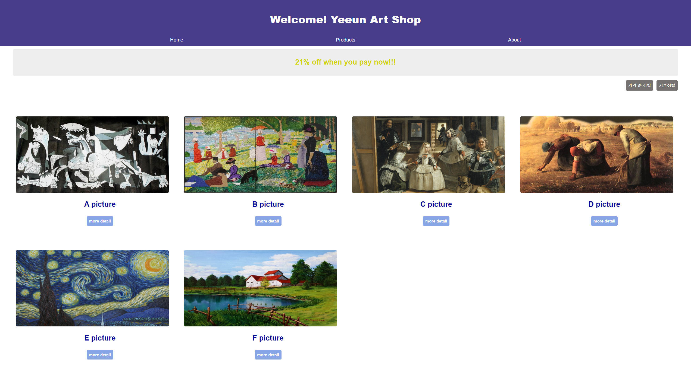

# Vue.js ArtShop
- 그림판매 사이트, 해당 그림내용 세부내용 조회

# 상세내용 
## 1. 개발환경 설정
- 개발환경 셋팅
- Vue3버전 설치

## 2. Vue 데이터 바인딩

## 3. 뷰 반복문을 사용한 메뉴 만들기

## 4. 뷰 이벤트 핸들러로 click시 이벤트함수 설정

## 5. Modal창 만들기
- v-if 사용하여 동적인 UI

## 6. 실 데이터 넣기
- js파일에서 data관리(데이터양 거대)
- import/export 사용하여 해당 데이터 사용

## 7. Modal창 컴포넌트화

## 8. Modal창 내의 상세페이지 만들기
- props 및 event 처리

## 9. 사용자 input 받기
- v-model
- 이벤트핸들러

## 10. 데이터유효성 검사
- watch사용 데이터 감시

## 11. Vre UI 애니메이션
- transition 사용
- enter-from/active/to
- leave-from/active/to

## 11. Vre UI 애니메이션
- spread operator
- sort()

## lifecycle hook
- beforeCreate()
- created()
- beforeMount()
- mounted()
- beforeUpdate()
- updated()
- beforeUnmount()
- unmounted()

# 기술 스택
- Vue.js 3
- javaScript
- HTML/CSS

# 개발 환경
- [Chrome](https://www.google.com/intl/ko/chrome/)
- [Git](https://git-scm.com/downloads)
- [Visual Studio Code](https://code.visualstudio.com/)
- [Node.js LTS 버전(v10.x 이상)](https://nodejs.org/ko/)
- [Vue.js Dev Tools](https://chrome.google.com/webstore/detail/vuejs-devtools/nhdogjmejiglipccpnnnanhbledajbpd)

# VSCode 플러그인 목록
- 색 테마 : [Night Owl](https://marketplace.visualstudio.com/items?itemName=sdras.night-owl)
- 파일 아이콘 테마 : [Material Icon Theme](https://marketplace.visualstudio.com/items?itemName=PKief.material-icon-theme)
- 뷰 확장 플러그인 : [Vetur](https://marketplace.visualstudio.com/items?itemName=octref.vetur)
- 뷰 코드 스니펫 : [Vue VSCode Snippets](https://marketplace.visualstudio.com/items?itemName=sdras.vue-vscode-snippets)
- 문법 검사 : ESLint, [TSLint](https://marketplace.visualstudio.com/items?itemName=eg2.tslint)
- 실습 환경 보조 : [Live Server](https://marketplace.visualstudio.com/items?itemName=ritwickdey.LiveServer)
- 기타
  - [Prettier](https://marketplace.visualstudio.com/items?itemName=esbenp.prettier-vscode), [Project Manager](https://marketplace.visualstudio.com/items?itemName=alefragnani.project-manager), [Auto Close Tag](https://marketplace.visualstudio.com/items?itemName=formulahendry.auto-close-tag), [GitLens](https://marketplace.visualstudio.com/items?itemName=eamodio.gitlens), [Atom Keymap](https://marketplace.visualstudio.com/items?itemName=ms-vscode.atom-keybindings), [Jetbrains IDE Keymap](https://marketplace.visualstudio.com/items?itemName=isudox.vscode-jetbrains-keybindings) 등
